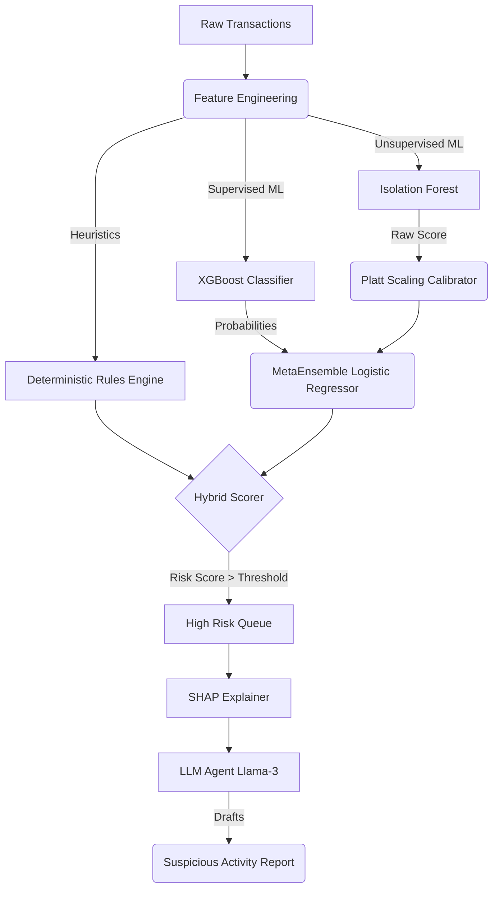

# Limier — Next-Gen AML Detection Platform

Limier is a state-of-the-art Anti-Money Laundering (AML) platform designed to detect complex laundering patterns using a 3-pillar hybrid detection architecture. It surfaces high-risk entities with explainable AI (SHAP) and uses an LLM Agent to automatically draft Suspicious Activity Reports (SARs).

## 🏛️ Architecture



## 🧠 The 3-Pillar Approach

1. **Deterministic Rules Engine**: Catches obvious regulatory violations (e.g., rapid cashouts, cross-border anomalies).
2. **Unsupervised Anomaly Detection (Isolation Forest)**: Detects novel laundering typologies by finding outliers in high-dimensional space without requiring labeled data.
3. **Supervised ML (XGBoost)**: Learns from historical confirmed fraud cases.
* **Calibrated MetaEnsemble**: Combines the Unsupervised and Supervised signals using Platt Scaling and a Logistic Meta-model, ensuring statistically sound probability combinations.

## 🚀 Getting Started

### Prerequisites
- Docker & Docker Compose
- Groq API Key (for Llama-3 SAR generation)

### Setup
1. Clone the repository
2. Copy `.env.example` to `.env` and insert your `GROQ_API_KEY`:
   ```bash
   cp .env.example .env
   ```
3. Run with Docker Compose:
   ```bash
   docker-compose up --build
   ```
4. Access the dashboard at `http://localhost:3000`. The backend API runs on `http://localhost:8000`.

## 🧪 Testing and Validation

Limier uses `pytest` for unit testing and `Optuna` for hyperparameter tuning. It tracks model metrics using local `MLflow`.

To run the validation suite (5-fold TimeSeriesSplit cross-validation and SHAP feature analysis):
```bash
cd backend
python src/validate.py
```

To run unit tests:
```bash
cd backend
python -m pytest tests/
```

To run the MLflow training script:
```bash
cd backend
python src/train.py
```

## 🛠️ Tech Stack
- **Frontend**: Next.js, React, TailwindCSS, Framer Motion, Recharts
- **Backend**: FastAPI, Python, Pandas, Pydantic
- **Machine Learning**: Scikit-learn, XGBoost, Optuna, MLflow, SHAP
- **Agent/LLM**: Llama-3 (via Groq API)